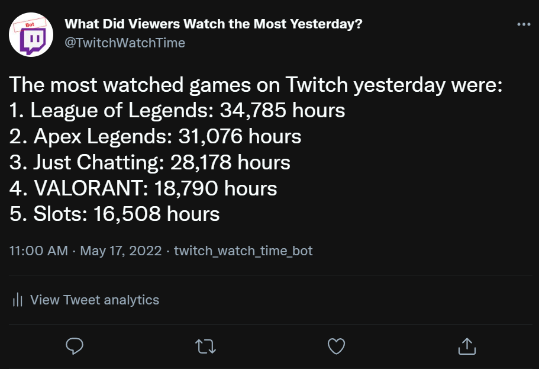
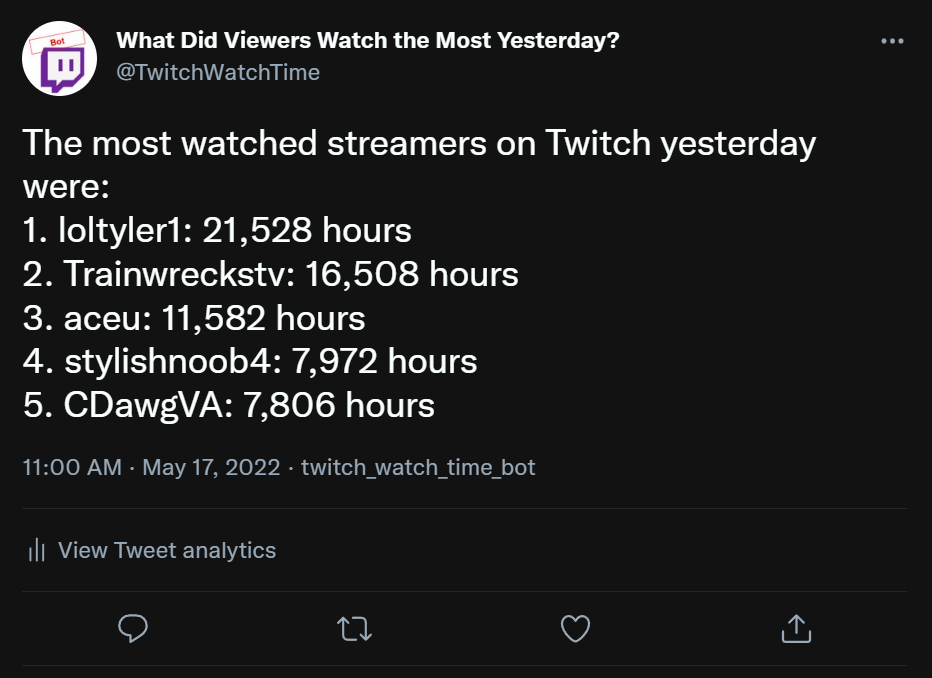
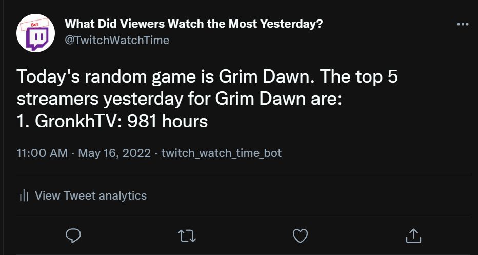
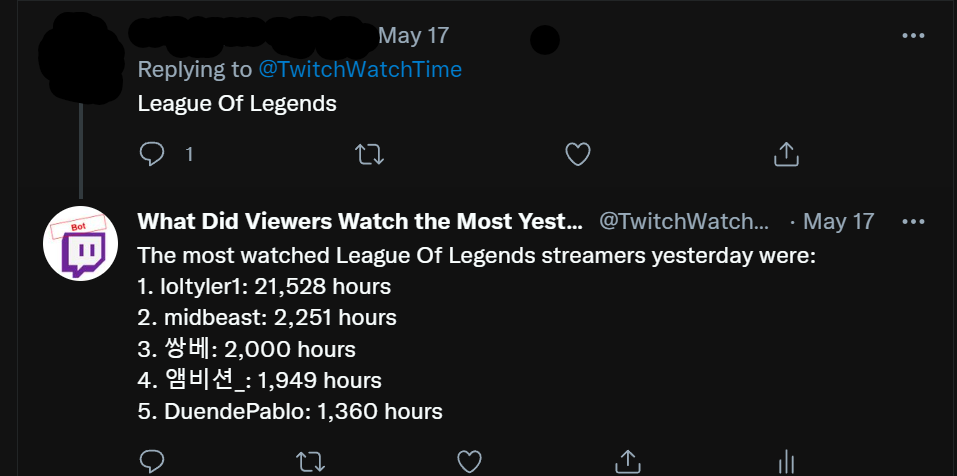

## Twitch Stream Watch Time Twitter Bot

I created a <a href="https://twitter.com/TwitchWatchTime" target="_blank">Twitter bot</a> that tweets daily watch time in hours for a variety of games and streamers. The bot will tweet yesterday's total watch time in hours for the top 5 streamers, games, and top 5 streamers of a random game. Twitter users may also query the data by tagging the bot (@TwitchWatchTime) in a Tweet containing a game or streamer name. The bot runs on a t2.micro EC2 instance.  It's containerized with Docker, so collaborators may easily run the bot on their own.  

You can see the bot in action <a href="https://twitter.com/TwitchWatchTime" target="_blank">here</a>.  

**Note:** Unfortunately, my AWS account was hacked and the bot isn't currently up and running. A lesson on security! Don't expose your keys.

### Data Sourcing and Storage
Every 30 minutes script requests data from the <a href="https://dev.twitch.tv/docs/api/" target="_blank">Twitch API</a> on viewer count and game name for all streamers who have over 50 viewers. After pulling the data, the script writes it to a series of staging tables in the PSQL database. Functions for reading and writing data from the Twitch API may be found in *helperfunctions/twitchAPI.py* and *helperfunctions/updateTables.py*.

### Sending Tweets
Each day at 8AM PTC, the bot will write the data stored in the staging tables to a series of permenant tables containing data for the past 24 hours. Because Twitch is a global platform, there is no defined start and end of each day. I analyzed Twitch viewership and learned it bottoms out each day at around 8AM PTC, which is why I determined each day will end at 8AM. Functions for writing data to the permenant tables may be found in *helperfunctions/updateTables.py*. 

Each day at 2PM PTC, the bot will tweet out the yesterday's viewing hours top 5 games, streamers, and top 5 streamers for a random game. View time is estimated and likely to be slightly high- because we pull data every 30 minutes, each view represents 30 minutes of view time. The random game tweeted is weighted on total game view time.

Additionally, users may tag the bot in a Tweet containing a game name or streamer name. If the name is found in the database, the bot will respond to that user with the top 5 streamers for that game or the top 5 games for that streamer.
image

**Note:** Tweet responses are sent every 30 minutes. The cadence could be improved by adding the tweet response code to a file separate from *main.py* and running that file with Cron more frequently. A web hook could also be used for near instantaneous response.

## Installation and Setup Instructions

Because I've containerized this app using Docker, users may easily run it within the project's container. 

To install Docker:

`sudo yum update -y`  
`sudo yum install docker -y` 

Users must also install Docker Compose:
`sudo curl -L "https://github.com/docker/compose/releases/download/1.26.0/docker-compose-$(uname -s)-$(uname -m)" -o /usr/local/bin/docker-compose`

`sudo mv /usr/local/bin/docker-compose /usr/bin/docker-compose`

`sudo chmod +x /usr/bin/docker-compose`

To start Docker:

`sudo service docker start`  

To compose the container, built from a Postgres image and Ubuntu image:

`docker-compose up`  

This app contains many API keys and secrets. To store these credentials safely, I used AWS Secrets Manager. Users will need to update API credential references. If they wish to use AWS Secrets Manager, they need to update the *AWS_ACCESS_KEY_ID* and *AWS_SECRET_ACCESS_KEY* env variables found in the Dockerfiles. 

## Reflection

I created this side project to explore technologies that I had minimal experience working with:
1. EC2
2. Docker
3. APIs
4. Database integration

### EC2
I had no experience hosting a project on EC2, but it was clearly the optimal solution for this use case. Because this bot runs 24/7, using my personal computer was not feasible. I deliberated over what instance size to use, but decided to go with AWS's limited free use t2.micro instance. The compute power required for the bot is minimal, but more storage would be useful for allowing users to query the bot for time periods beyond 1 day. I could've also used AWS's RDS service for my database, but decided this was beyond the scope of the project.
 
Beyond storage space, the t2.micro compute power became an issue when SSHing in through VS Code and while performing code changes when testing. Spikes in compute would often use all my CPU credits, leading to a crash. I found the quickest way to restore the SSH connection was to reboot the instance.
 
I used AWS Secrets Manager to store credentials. I've used many different tools for credentials storage, but found Secrets Manager useful for its ability to share credentials across different AWS services.

### Docker
While it's unlikely anyone else will ever work on this project, I wanted to containerize it to learn more about Docker. Because this project required multiple images (Postgres and Ubuntu), I needed to user a *docker-compose.yml* file.  Docker Compose is a tool created to help define and share multi-container applications.  The Postgres image was an easy choice for the app's database, but Ubuntu was chosen so I could run the Python file using a Cron job within the container. Because the script requires env variables (AWS credentials and DB host) to run and Cron can not easily access env variables, I wrote *entrypoint.sh* to move the env variables to *etc/environment* where they can be accessed by Cron. 

### APIs
I've worked with APIs several times in the past, but more experience never hurts. The Twitch API was fairly easy to use, but only allowed querying Twitch data for the current time. This is what led to the design decision of creating a database. Because I couldn't get past data with the API, I requested the API in 30 minutes intervals and wrote the payload to the database.
 
The Twitter API was fairly simple to work with. My biggest frustration was due to their recent transition from V1 of the API to V2. This made it difficult to find accurate documentation on V2 - many sources were referencing V1 calls without stating the version.

### Database integration
I have significant experience working with and querying databases, but I haven't created one in a few years. Installing a PSQL and setting up a database were both relatively simple tasks. The only significant issue I ran into was accessing the database with the Python package *psycopg2* from within a container.
 
*psycopg2* function *pg2.connect()* takes an optional host argument to connect to your database. If not specified, it defaults to localhost. When running with Docker, the PostgresSQL Image database host address is set to the name of the image (ex: *db*), **not localhost**. Therefore, I had to set and env variable equal to the host with value *db* so *pg2.connect()* could connect to the database within the Docker container.
